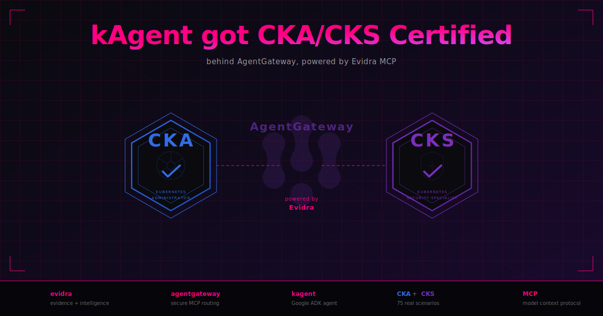

<p align="center">
  
</p>

# evidra-kagent-bench

Evidra gives [AgentGateway](https://agentgateway.dev) an evidence and intelligence layer —
auto-recording every infrastructure mutation with risk assessment and behavioral
signal detection — then uses it to certify [kagent](https://github.com/kagent-dev/kagent)
against 75 real infrastructure scenarios (Kubernetes, Helm, ArgoCD, Terraform, AWS).

See [hackathon submission](docs/hackathon/submission.md) for the full story, and
[blog post](docs/hackathon/blog-post.md) for the technical deep dive.

## Quick Start

```bash
cp .env.example .env          # set at least one LLM provider key
docker compose build kind-bootstrap
docker compose run --rm kind-bootstrap
docker compose up -d
open http://localhost:28080/lab
```

Demo data (bench runs, evidence, scenarios) is auto-seeded on first start.
API key for authenticated pages: **`dev-api-key`**

## UI Pages

| Page | URL | What you see |
|------|-----|--------------|
| Run Benchmark | [/lab/run](http://localhost:28080/lab/run) | Select model + scenarios, trigger a run |
| Leaderboard | [/lab/bench](http://localhost:28080/lab/bench) | Model rankings — pass rate, cost, speed |
| All Runs | [/lab/bench/runs](http://localhost:28080/lab/bench/runs) | Every benchmark run with details |
| Scenarios | [/lab/bench/scenarios](http://localhost:28080/lab/bench/scenarios) | 75 scenario catalog (CKA/CKS + Terraform) |
| Evidence | [/evidence](http://localhost:28080/evidence) | Evidence chain — tool calls, risk, verdicts |
| Dashboard | [/bench](http://localhost:28080/bench) | Trigger scenarios, view progress |

## Tests

```bash
cd tests/e2e && npm install && npx playwright install --with-deps chromium
npm run test:smoke   # UI pages load (no LLM key needed)
npm run test:full    # triggers a real benchmark run
```

## Cleanup

```bash
docker compose down -v --remove-orphans
kind delete cluster --name evidra-demo
```

## License

Apache 2.0
